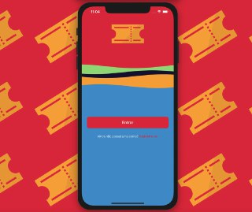
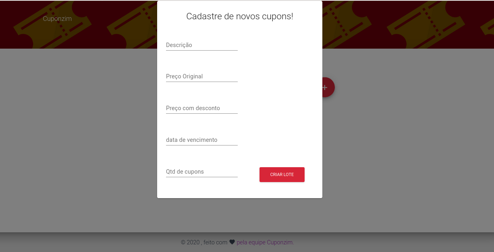
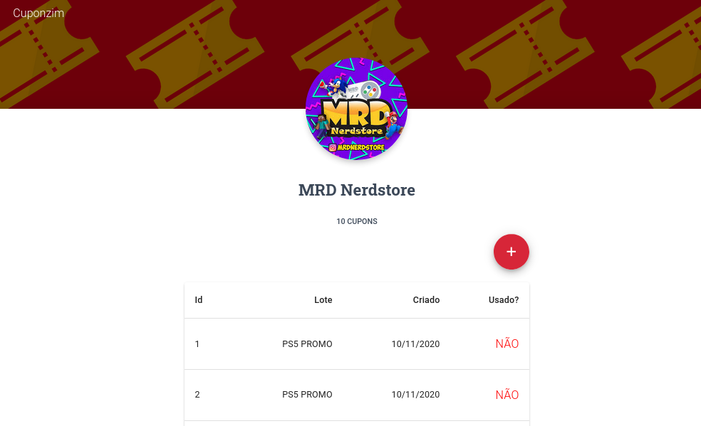
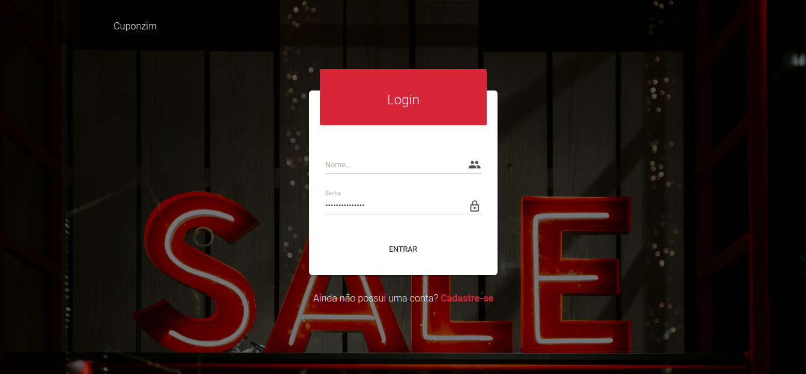

# Cupomzin

**Número do Grupo**: 8 
**Código da Disciplina**: FGA0208-T01 

## Alunos
|Matrícula | Aluno |
| -- | -- |
| 17/0036634  | João de Assis da Silva Carneiro |
| 17/0039668  | Lucas Ganda Carvalho |
| 17/0146251  | João Lucas Fragoso Zarbielli |
| 17/0047326  | Wictor Bastos Girardi  |
| 17/0056155  | André Aben-Athar de Freitas |

## Sobre 
Cuponzim é um projeto que busca facilitar a maneira de você comprar dentro de shoppings,outlets e feiras. Por meio do nosso aplicativo o cliente vai poder encontrar cupons exclusivos para comprar produtos variados com descontos de maneira simplificada. O varejista vai poder cadastrar suas promoções por meio de uma plataforma web voltada para lojas.

## Explicação da arquitetura e projeto
https://youtu.be/vO-7JdHXtgo

## Apresentação do projeto
https://youtu.be/scv4yKQyPGE

## Link dos outros repositórios
<a href='https://github.com/UnBArqDsw/2020.1_G8_CUPONZIM_BACKEND'>Backend</a>, <a href='https://github.com/UnBArqDsw/2020.1_G8_CUPONZIM_FRONTEND'>Frontend Mobile</a> e <a href='https://github.com/UnBArqDsw/2020.1_G8_CUPONZIM_FRONTEND_WEB'>Frontend Desktop</a>
## Screenshot 
### Mobile

### Desktop

## Tecnologias
**Linguagens**: JavaScript, Dart 
**Tecnologias**: Docker, Postgres, ReactJs, Nodejs, Flutter 

