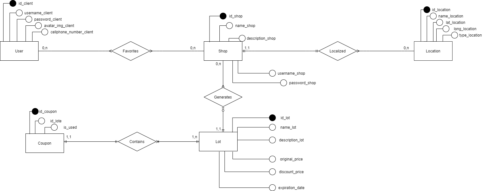
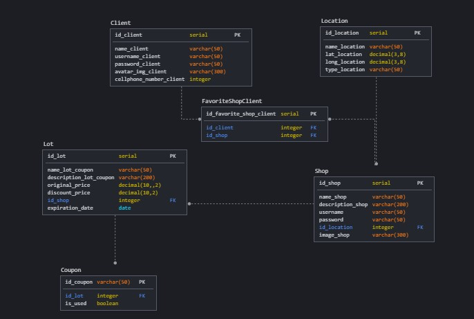

# Diagrama de Banco de Dados
| Data       | Versão | Descrição                                          | Participantes                                                                   |
| ---------- | ------ | -------------------------------------------------- | ------------------------------------------------------------------------------- |
| 26/09/2020 | 1.0   | Criação do documento | João de Assis, Lucas Zarbielli|
| 27/09/2020 | 1.1   | Criação e adição do MER | Lucas Ganda |

# 1. Introdução
Com o intuito de modelar o banco de dados, optou-se pelo uso de três documentos que precedem a criação do banco e guiam sua correta estruturação, são eles: Modelo Entidade-Relacionamentos (ME-R) , Diagrama Entidade-Relacionamentos (DE-R) e Diagrama Lógico (DL).

# 2. Diagramas Elaborados
## 2.1 Modelo Entidade-Relacionamento

### Entidades:
CLIENT  
SHOP 
LOCATION 
COUPON 
LOT 

### Atributos:
CLIENT (id_client, username_client, password_client, avatar_img_client, cellphone_number_client) 
SHOP (id_shop, name_shop, description_shop, username_shop, password_shop) 
LOCATION (id_location, name_location, lat_location, long_location, type_location) 
COUPON (id_coupon, id_lote, is_used) 
LOT (id_lot, name_lot, description_lot, original_price, discount_price, expiration_date)

### Relacionamentos:

CLIENT  - favorites -  SHOP
⟶  Um usuário favorita várias lojas e uma loja é favoritada por vários usuários.
Cardinalidade  n : m

SHOP  - localized -   LOCATION
⟶  Uma loja está localizada em um lugar e um mesmo lugar pode conter várias lojas.
Cardinalidade  1 : n

SHOP - generates -  LOT
⟶  Uma loja gera diversos lotes, mas cada lote só é gerado por uma mesma loja.
Cardinalidade  1 : n

LOT  - contains - COUPON
⟶  Um mesmo lote contêm diversos cupons, mas um cupom só pertence a um lote.
Cardinalidade  1 : n

## 2.2 Diagrama Entidade-Relacionamento

## 2.3 Diagrama Lógico

# 3. Referências

Diagrama Entidade - Relacionamento (DER), Disponível em: https://medium.com/@mauriciogeneroso/banco-de-dados-diagrama-entidade-x-relacionamento-der-5ce497d930db Acesso em: 26 set. 2020
