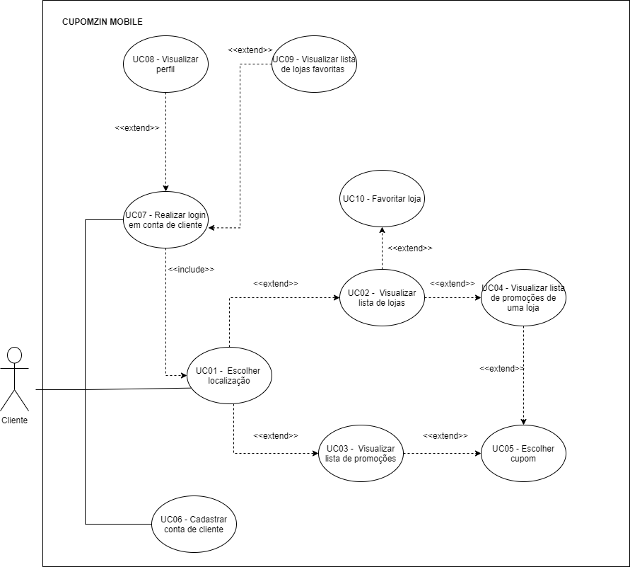
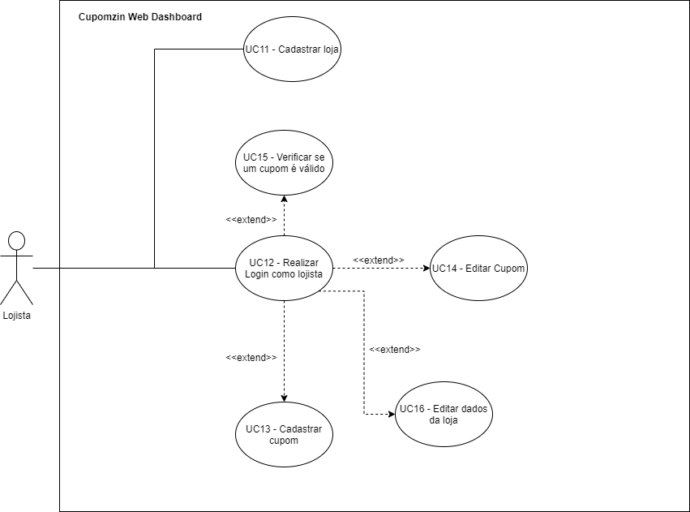

# Diagrama de Casos de Uso
| Data       | Versão | Descrição                                          | Participantes                                                                   |
| ---------- | ------ | -------------------------------------------------- | ------------------------------------------------------------------------------- |
| 26/09/2020 | 1.0   | Criação do documento | João de Assis|
| 26/09/2020 | 2.0   | Refatorando documento | João Lucas, Lucas Ganda, João de Assis |

## 1. Diagrama de Casos de Uso
Esse diagrama documenta o que o sistema faz do ponto de vista do usuário. Em outras palavras, ele descreve as principais funcionalidades do sistema e a interação dessas funcionalidades com os usuários do mesmo sistema. Nesse diagrama não nos aprofundamos em detalhes técnicos que dizem como o sistema faz.

## 2. Atores envolvidos
### 2.1 Cliente
Como especificado no documento de [Léxicos](Lexico.md), é o usuário que utiliza o app para receber cupons de desconto

### 2.2 Lojista
Como especificado no documento de [Léxicos](Lexico.md), é o usuário que utiliza o serviço de dashboard Web para cadastrar, validar e editar cupons.

## 3. Diagramas elaborados

### 3.1 Diagrama de Casos de Uso do Cliente

### 3.2 Diagrama de Casos de Uso do Cliente 2.0 

### 3.2 Diagrama de Casos de Uso do Lojista

## 4 Referências
UML. Use Case Diagrams. [S. l.]. Disponível em: https://www.uml-diagrams.org/use-case-diagrams.html. Acesso em: 26 set. 2020.