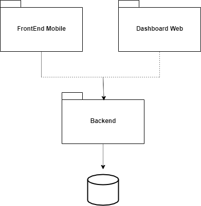
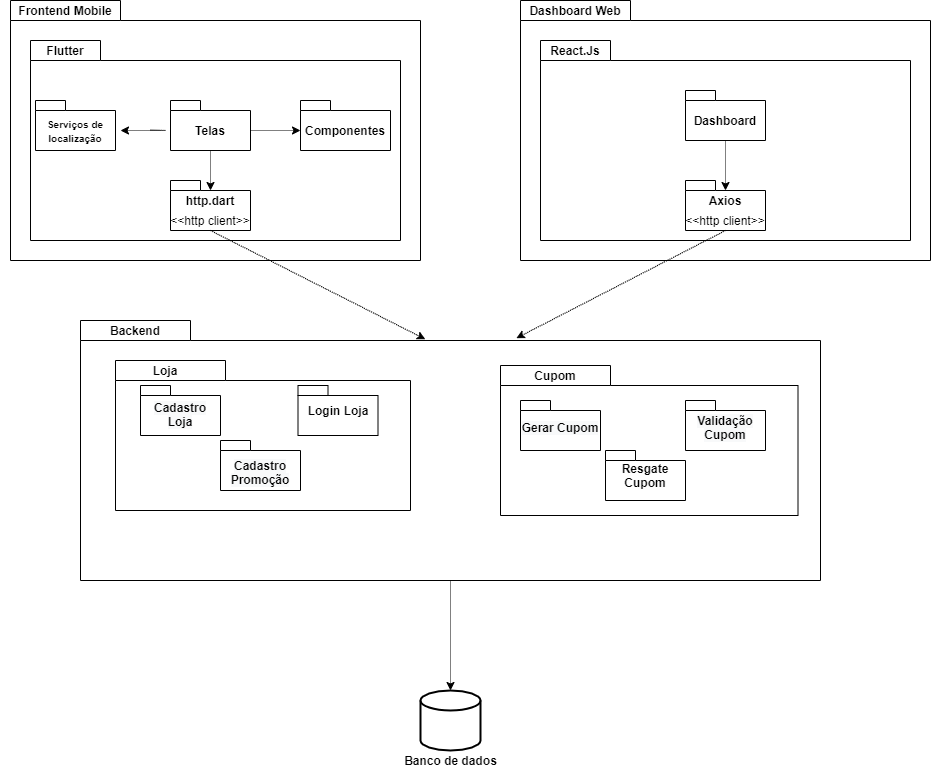

| Data       | Versão | Descrição                                          | Participantes                                                                   |
| ---------- | ------ | -------------------------------------------------- | ------------------------------------------------------------------------------- |
| 25/09/2020 | 1.0    | Criação do documento | André Freitas, João de Assis, Lucas Ganda, João Lucas Zarbiélli, Wictor Girardi |
| 26/10/2020 | 1.1    | Realizando modificações pontuais no diagrama detalhado |  João de Assis|
| 20/11/2020 | 1.2    | Linkando com artefato |  Lucas Ganda|
# 1.Introdução
A Unified Modelling Language (UML) é uma linguagem ou notação de diagramas para especificar,visualizar e documentar modelos de ‘software’. A UML é composta por muitos elementos de modelos que representam as diferentes partes de um sistema de software. Os elementos UML são usados para criar diagramas, que representam um determinada parte, ou um ponto de vista do sistema.
# 2. UMLs Estáticos
Diagramas UMLs estáticos são diagramas que tratam da parte estrutural do projeto que possuem aspectos mais estáticos, isto é, que não tem tanto a ver com o comportamento do sistema. Geralmente aspectos estáticos de um sistema estão atrelados às definições de classes, interfaces e componentes.

### Diagrama de Pacotes
O Diagrama de pacotes definido pela UML, descreve os pacotes ou pedaços do sistema divididos em agrupamentos lógicos mostrando as dependências entre eles. Este diagrama é muito utilizado para ilustrar a arquitetura de um sistema mostrando o agrupamento de pacotes existentes na aplicação.
# 3. Diagramas elaborados

Foram elaborados 2 diagramas de pacotes, um resumido e outro mais detalhado

Diagrama Resumido:

Diagrama Detalhado:

 Diagrama feito usando como referência o documento : [Rich Picture](rich_picture.md)
 

# Referências 
- Lucidchart.com. 2020. [online] Disponível em: <https://www.lucidchart.com/pages/pt/diagrama-de-pacotes-uml> [Acesso: 20 November 2020].