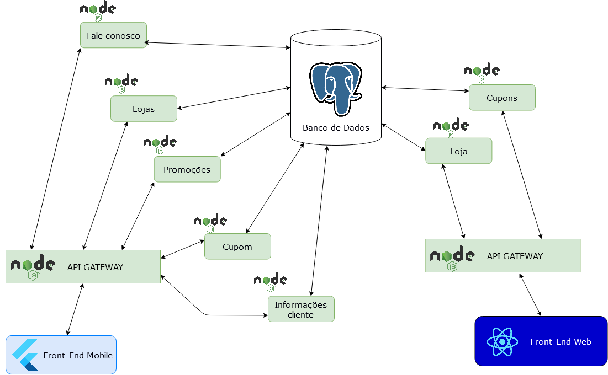
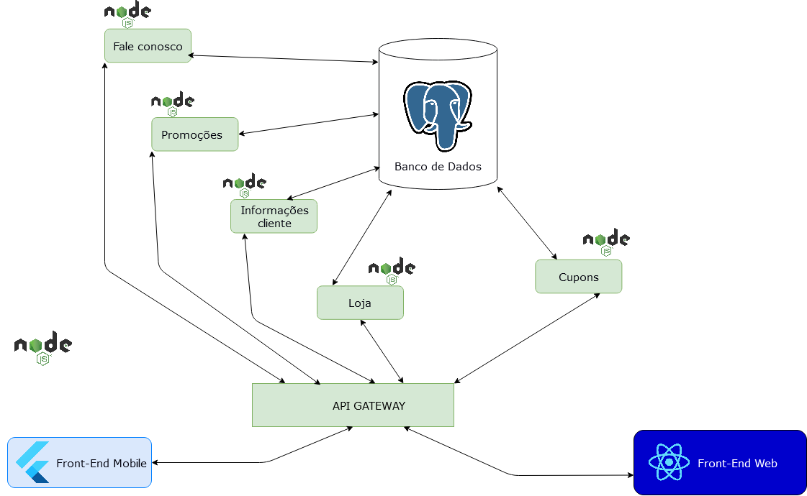
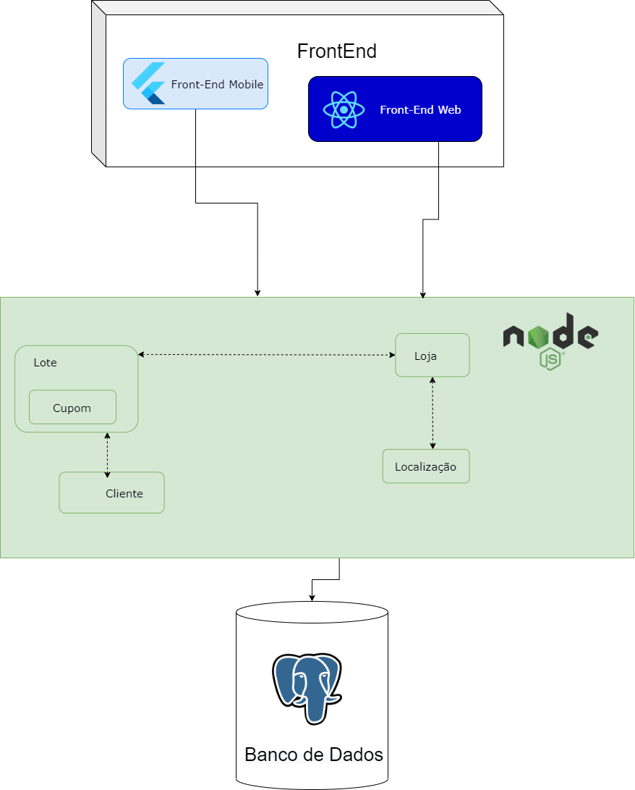

# Histórico de versão

| Data       | Versão | Descrição                                          | Participantes                                                                   |
| ---------- | ------ | -------------------------------------------------- | ------------------------------------------------------------------------------- |
| 26/09/2020 | 1.0    | Criação do documento | Lucas Ganda e André Freitas|
| 27/09/2020 | 1.1    | Correção do documento | Lucas Ganda |
| 17/11/2020 | 2.0    | Corrigindo a arquitetura | Lucas Ganda |
| 20/11/2020 | 2.1    | Linkando com artefato | Lucas Ganda |

 

# Diagrama de Contexto

Um diagrama de contexto é o diagrama de fluxo de dados considerado o de mais alto nível, sendo uma forma de identificar o escopo do projeto, as áreas envolvidas com o processo e sua relação com o ambiente.

## Versão 1.0

## Versão 1.1

## Versão 2.0

 Diagramas feitos usando como base o documento - [Rich Picture](rich_picture.md) e o  [5W2H](5W2H.md)
 

## Referências
Freitas, É., Muhamad, Y. and Dutra, L., 2020. Document. [online] Pax-app.github.io. Disponível em: <https://pax-app.github.io/Wiki/#/docs/DS/dinamica-e-seminario-3/DiagramaContexto> [Accesado 26 September 2020].
 
Edrawmax.com. 2020. What Is A Context Diagram – Explain With Examples. [online] Disponível em: <https://www.edrawmax.com/context-diagram/> [Accessado 26 September 2020].