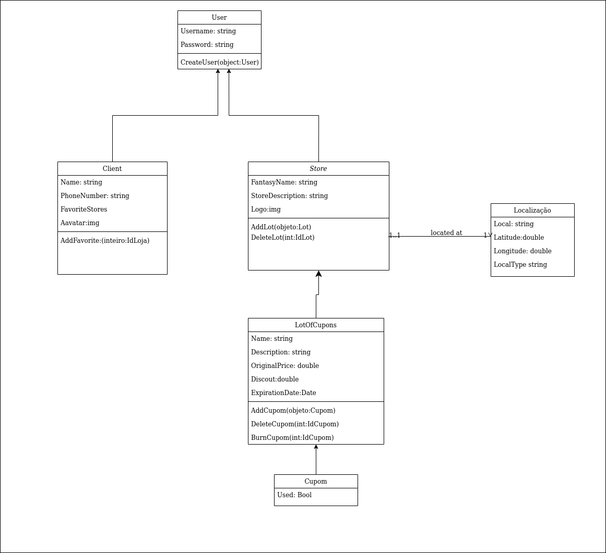
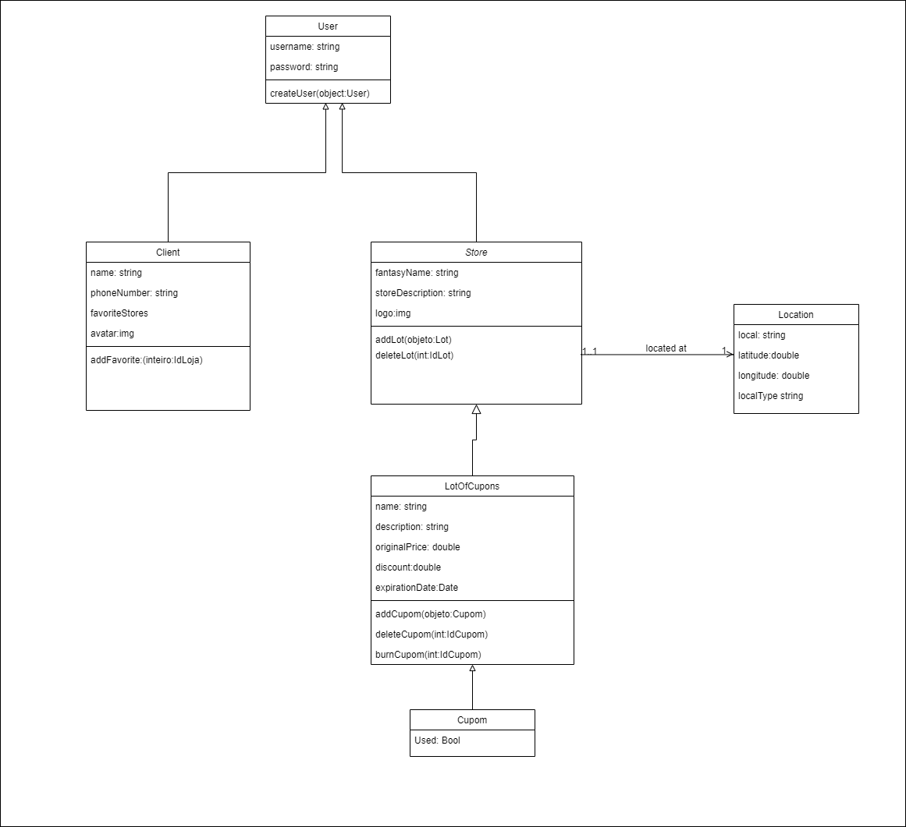

# Histórico de versão

| Data       | Versão | Descrição                                          | Participantes                                                                   |
| ---------- | ------ | -------------------------------------------------- | ------------------------------------------------------------------------------- |
| 27/09/2020 | 1.0    | Criação do documento | André Freitas |
| 20/11/2020 | 2.0    | Corrigindo | André Freitas e Lucas Ganda |
| 20/11/2020 | 2.1    | Mantendo rastro com outros artefatos| Lucas Ganda |
 

# Diagrama de Classes

Um diagrama de classes UML é uma notação gráfica usada para construir e visualizar sistemas orientados a objetos. Um diagrama de classes na Unified Modeling Language (UML) é um tipo de diagrama de estrutura estática que descreve a estrutura de um sistema, como o apresentado a seguir:

### Diagrama de Classe
## v1.0

## v2.0

## Diagramas desenvolvidos usando como base o documento de  [Rich Picture](rich_picture.md)
 

## Referências

[Visualparadigm.com](https://www.visual-paradigm.com/guide/uml-unified-modeling-language/uml-class-diagram-tutorial/) **Class Diagram**

