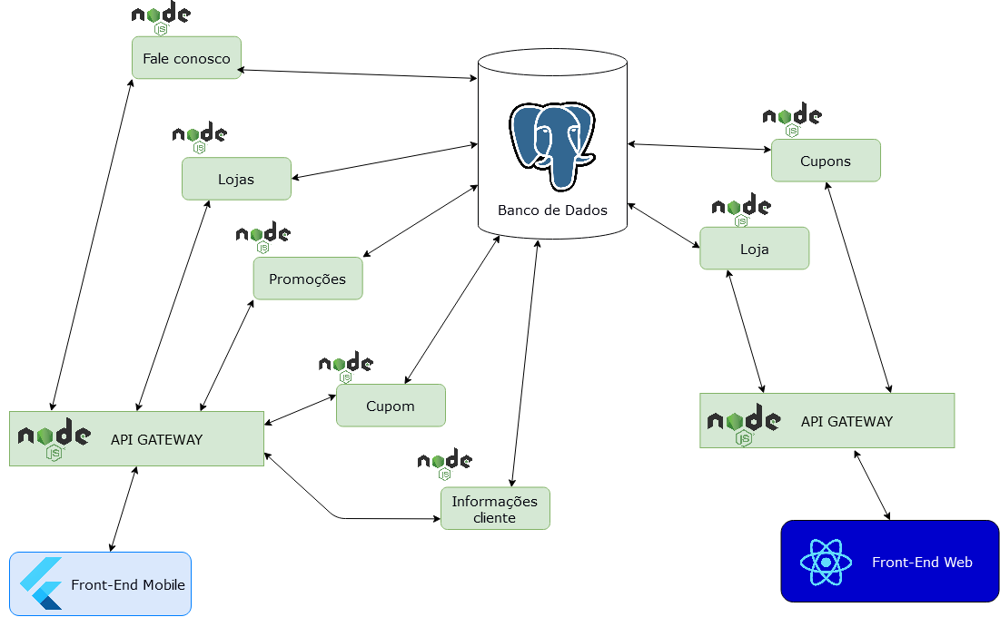
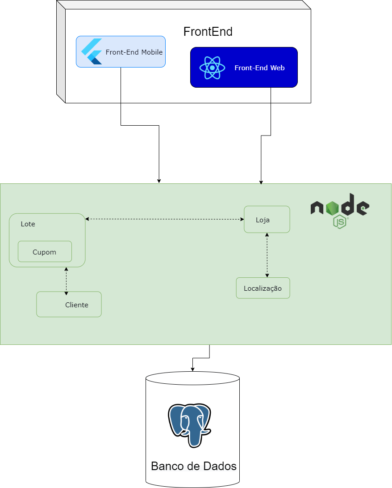
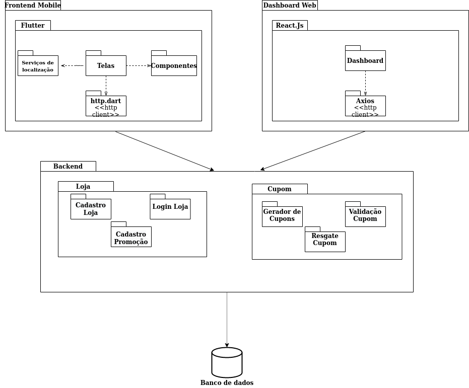
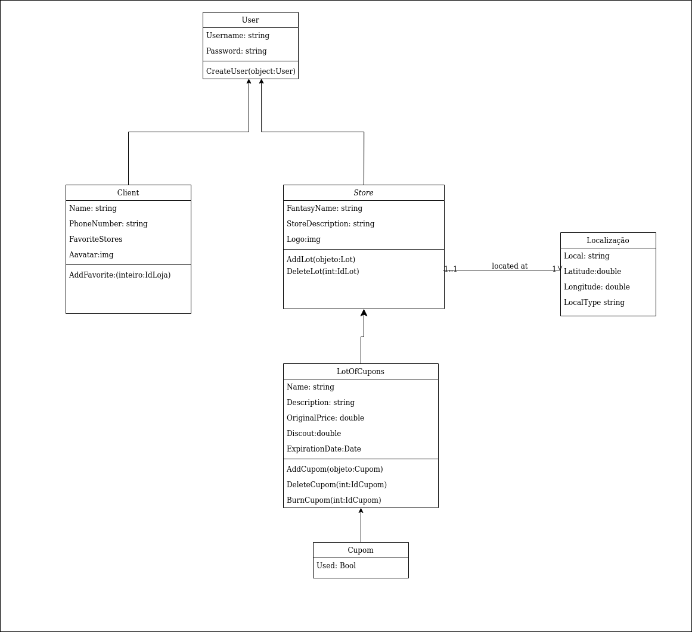
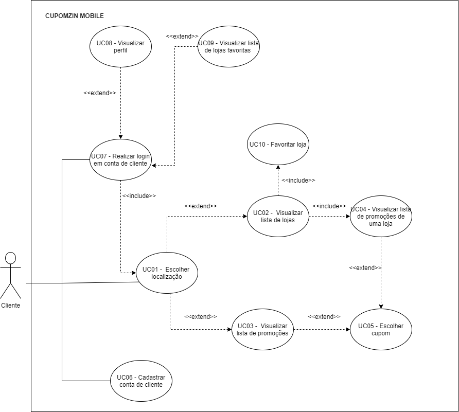

# Documento de Arquitetura de Software

# Histórico de versão

| Data       | Versão | Descrição                                          | Participantes                                                                   |
| ---------- | ------ | -------------------------------------------------- | ------------------------------------------------------------------------------- |
| 27/09/2020 | 1.0    | Criação do documento | João de Assis|
| 26/10/2020 | 1.1    | Adicionando TypeOrm as tecnologias utilizadas | João de Assis|
| 16/11/2020 | 1.2    | Adicionando finalidade e escopo | Lucas Ganda | 
| 17/11/2020 | 1.3    | Melhorando a descrição das tecnologias| Lucas Ganda |
| 17/11/2020 | 1.4    | Adicionando especificações da arquitetura| Lucas Ganda | 
| 17/11/2020 | 1.5    | Adicionando especificações da arquitetura| Lucas Ganda |
 

# 1. Introdução

## 1.1 - Finalidade
Este documento visa conceder de forma geral uma visão arquitetural da aplicação, tendo como finalidade especificar e documentar as decisões tomadas no que tange a arquitetura da produção e implementação do projeto Cuponzim, serão também utilizados alguns documentos como restrições, metas e diagramas para ratificar essas decisões tomadas.

## 1.2 - Escopo
Este documento se refere à criação e desenvolvimento do aplicativo Cuponzim, desenvolvido para a matéria de Arquitetura e Desenho de Software. De forma resumida, a aplicação consiste em um aplicativo que oferece de forma unificada cupons de descontos em shoppings, feiras, outlets e afins. A aplicação consiste também de uma aplicação web que permite ao lojista adicionar, atualizar e excluir cupons de seu estabelecimento.

# 2. Tecnologias utilizadas
## 2.1. Front End
* ### 2.1.1. Flutter
    Flutter é o kit de ferramentas de interface do usuário do Google para criar aplicativos belos e compilados nativamente para dispositivos móveis, Web e desktop a partir de uma única base de código. É um framework que possui como linguagem base o Dart.

    O Flutter foi escolhido por alguns motivos diferentes, como por ser uma tecnologia emergente no mercado, que vem se consolidando cada vez mais. Também por ser uma ferramenta que possui um rápido desenvolvimento, por ter uma curva de aprendizado não tão alta e por possuir ótimas ferramentas como seu hot reload, que permite ver as alterações feitas de forma rápida, sem precisar rodar novamento o código. Outro motivo foi o fato de uma parte da equipe já ter tido contato com essa tecnologia.

* ### 2.1.2. React.js
    O React é uma biblioteca JavaScript de código aberto com foco em criar interfaces de usuário em páginas web. É mantido pelo Facebook, Instagram, outras empresas e uma comunidade de desenvolvedores individuais.

    O React.js foi escolhido pois é facilmente uma das tecnologias mais consolidadas e valiosas no mercado, além de parte da equipe também já ter contato prévio com essa ferramenta.

## 2.2. Back End
* ### 2.2.1. Express
    O Express é um framework para aplicações web em Node.js. Pequeno e flexível, fornecendo um conjunto robusto de recursos para aplicativos web e mobile.

    O Express foi escolhido pois é um framework com bastante liberdade de implementação e também por possuir uma comunidade bem ativa.

* ### 2.2.2 TypeScript
    TypeScript é uma linguagem de programação desenvolvida e mantida pela Microsoft, embora seja mais apropriado definí-lo como um conjunto de funcionalidades adicionadas ao JavaScript já que o typescript é totalmente convertido para javascript no processo de build de produção.

    O TypeScript foi escolhido pois é mais simples de refatorar, possui uma comunidade bastante ativa, é mais fácil de evitar erros e por facilitar o desenvolvimento devido à sua tipagem.

* ### 2.2.3 TypeORM
    O TypeORM é um módulo avançado de gerenciamento de relações de objeto que é executado no Node. js. Como o nome indica, o TypeORM deve ser usado com o TypeScript.

    O TypeORM foi escolhida pois ela é a responsável por integrar com o Typescript.

## 2.3. Banco de Dados
* ### 2.3.1. PostgreSQL
    PostgreSQL é um poderoso sistema de banco de dados relacional de objetos de código aberto, com mais de 30 anos de desenvolvimento ativo, que ganhou uma forte reputação de confiabilidade, robustez de recursos e desempenho.

    O PostgreSQL foi utilizado por ser uma tecnologia que vem sendo cada vez mais utilizada no mercado, por ser grátis e open-source, possuir ótimo suporte ao JSON, e por poder customizar tipos. 

 

# 3. Restrições e metas arquiteturais

|     Metas      |                                                                            |
| :------------: | :------------------------------------------------------------------------: |
| Escalabilidade |                       A aplicação deve ser escalável                       |
|   Segurança    | A aplicação deve tratar de forma de segura os dados sensíveis dos usuários |
|     Deploy     |                A aplicação deve possuir deploy automatizado                |

|  Restrições   |                                                                |
| :-----------: | :------------------------------------------------------------: |
| Conectividade |   É necessária a conexão com internet para utilização do App   |
|  Plataforma   |         A aplicação terá suporte para Android e iOS         |
|    Público    |  A aplicação será desenvolvida voltada ao público brasileiro   |
|   Linguagem   |      A aplicação será desenvolvida em português do Brasil      |
|    Equipe     |             A equipe possui 5 integrantes              |
|     Prazo     | O escopo proposto deve ser terminado até o final da disciplina |

 
 

# 4. Arquitetura Monolítica vs Distribuída
Inicialmente, o grupo adotaria uma arquitetura de microsserviços, modularizando os elementos do backend conforme a funcionalidade implementada (Cupons, Pessoas e Lojas). Entretanto, foi adotada uma arquitetura híbrida, com aspectos de microsserviços, organizando a aplicação em dois serviços de frontend e um único serviço de backend. Enquanto o frontend está dividido entre um serviço responsável pelo aplicativo mobile e outro pelo aplicativo web, o backend apresenta aspectos de arquitetura monolítica, contando com a implementação de Models e Controllers, de forma que cada serviço do frontend possa recorrer a uma API estável através dos mesmos endpoints.

### [Link para o documento original](DiagramaDeContexto.md)

Primeiro diagrama de contexto
  

Diagrama de contexto atualizado
  
 
 

# 5. Padrão Arquitetural

São templates prontos que solucionam problemas arquiteturais
recorrentes, expressam um esquema fundamental de organização estrutural para
sistemas de software e fornecem um conjunto de subsistemas prédefinidos, especificando suas responsabilidades e incluindo regras e diretrizes para organizar as relações entre eles. Sendo o MVC o padrão arquitetural escolhido para o projeto.

## MVC
MVC (Model-View-Controller) é um padrão de arquitetura de software formulado na década de 1970, focado no reuso de código e a separação de conceitos em três camadas interconectadas, onde a apresentação dos dados e interação dos usuários (front-end) são separados dos métodos que interagem com o banco de dados (back-end).

Normalmente usado para o desenvolvimento de interfaces de usuário que divide uma aplicação em partes (camadas/componentes) interconectadas. Isto é feito para separar representações de informação internas dos modos como a informação é apresentada para e aceita pelo usuário, levando ao desenvolvimento paralelo de maneira eficiente.

## Model 
Model é a ponte entre as camadas Visão (View) e Controle (Controller), consiste na parte lógica da aplicação, que gerencia o comportamento dos dados através de regras de negócios, lógica e funções. Esta espera a chamada das funções, que permite o acesso para os dados serem coletados, gravados e, exibidos.

## View 
View pode ser qualquer saída de representação dos dados, como uma tabela ou um diagrama. É onde os dados solicitados da Model são exibidos. É possível ter várias visões do mesmo dado, como um gráfico de barras para gerenciamento e uma visão tabular para contadores. A View também provoca interações com o usuário, que interage com a Controller. O exemplo básico disso é um botão gerado por uma View, no qual um usuário clica e aciona uma ação na Controller.

## Controller
Controller é o componente final da tríade, faz a mediação da entrada e saída, comandando a visão e o modelo para serem alterados de forma apropriada conforme o usuário solicitou. O foco da controller é a ação do usuário, onde são manipulados os dados que o usuário insere ou atualiza, chamando em seguida a Model.

 
 

# 6. Visões Arquiteturais
A arquitetura de um software é representada por uma série de
visões arquiteturais, as quais, em essência, são fragmentos que
ilustram os elementos "significativos em termos de arquitetura"
em modelos, separa diferentes aspectos em visões separadas com o objetivo de gerenciar complexidade. As Visões permitem reduzir a quantidade de informação que o arquiteto trata em um dado
momento
 
## Visão Lógica
•A Visão Lógica mostra como está a organização conceitual do sistema em termos de camadas, pacotes, classes e interfaces. Sendo visualizada através de diversos diagramas de classes, de sequência, de colaboração, e de pacotes.

## Diagrama de Pacotes.
### [Link para o documento completo](DiagramaDePacotes.md)

## Diagrama de Classes.
### [Link para o documento completo](DigramaClasse.md)

## Visão de Casos de Uso
• É uma visão que documenta o que o sistema faz do ponto de vista do usuário. Em outras palavras, ele descreve as principais funcionalidades do sistema e a interação dessas funcionalidades com os usuários do mesmo sistema. 

### [Link para o documento completo](DiagramaCasosDeUso.md)

## Visão de Dados
• A Visão de Dados mostra como está arquiteturada a camada de persistência do projeto, mapeando os objetos e os modelos de dados.

### [Link para o documento completo](DiagramaBancoDeDados.md)

## Visão de Implementação
• A visão de implementação descreve como o sistema será implementado, sendo visualizado especialmente através do diagrama de componentes.
### [Link para o documento completo](componentDiagram.md)

# 7. Referências

- DONG, Tao. **Flutter**. [S. l.], 2019. Disponível em: https://medium.com/flutter. Acesso em: 27 set. 2020.
- MALLAWAARACHCHI, Vijini. **10 Common Software Architectural Patterns in a nutshell**. [S. l.], 2017. Disponível em: https://towardsdatascience.com/10-common-software-architectural-patterns-in-a-nutshell-a0b47a1e9013. Acesso em: 27 set. 2020.
- **NODE.JS**. In: WIKIPÉDIA, a enciclopédia livre. Flórida: Wikimedia Foundation, 2019. Disponível em: <https://pt.wikipedia.org/w/index.php?title=Node.js&oldid=55592828>. Acesso em: 27 set. 2020.
- PANT, Prabhu. **A complete guide to PostgreSQL**. [S. l.], 2018. Disponível em: https://medium.com/@heyPrabhu/a-complete-guide-to-postgresql-e4d1cefb9866. Acesso em: 27 set. 2020.
- RICHARDSON, Chris. **Pattern**: Decompose by subdomain. [S. l.]. Disponível em: https://microservices.io/patterns/decomposition/decompose-by-subdomain.html. Acesso em: 27 set. 2020.
- RICHARDSON, Chris. **What are microservices?**. [S. l.]. Disponível em: https://microservices.io/index.html. Acesso em: 27 set. 2020.
- WAYNER, Peter. **The top 5 software architecture patterns**: how to make the right choice. [S. l.]. Disponível em: https://techbeacon.com/app-dev-testing/top-5-software-architecture-patterns-how-make-right-choice. Acesso em: 27 set. 2020.
- Blog da Rocketseat. 2020. **Typescript: Vantagens, Mitos, Dicas E Conceitos Fundamentais.** [online] Disponível em: <https://blog.rocketseat.com.br/typescript-vantagens-mitos-conceitos/> [Acesso em 17 November 2020].
- Pt.wikipedia.org. 2020. **MVC**. Disponível em: <https://pt.wikipedia.org/wiki/MVC>. [Accesso em: 17 November 2020].
- SERRANO, Milene. **Arquitetura e Desenho de Software: estilos e padrões arquiteturais i. ESTILOS E PADRÕES ARQUITETURAIS I**. Disponível em: <https://aprender3.unb.br/pluginfile.php/26819/mod_label/intro/Arquitetura%20e%20Desenho%20de%20Software%20-%20Aula%20Estilos%20e%20Padr%C3%B5es%20Arquiteturais%20I%20-%20Profa.%20Milene.pdf>. Acesso em: 14 nov. 2020.
- Dimap.ufrn.br. 2020. **Visões Arquiteturais**. [online] Disponível em: <http://www.dimap.ufrn.br/~thais/MES20072/aulaVisoes.pdf> [Accesso em: 17 November 2020].
