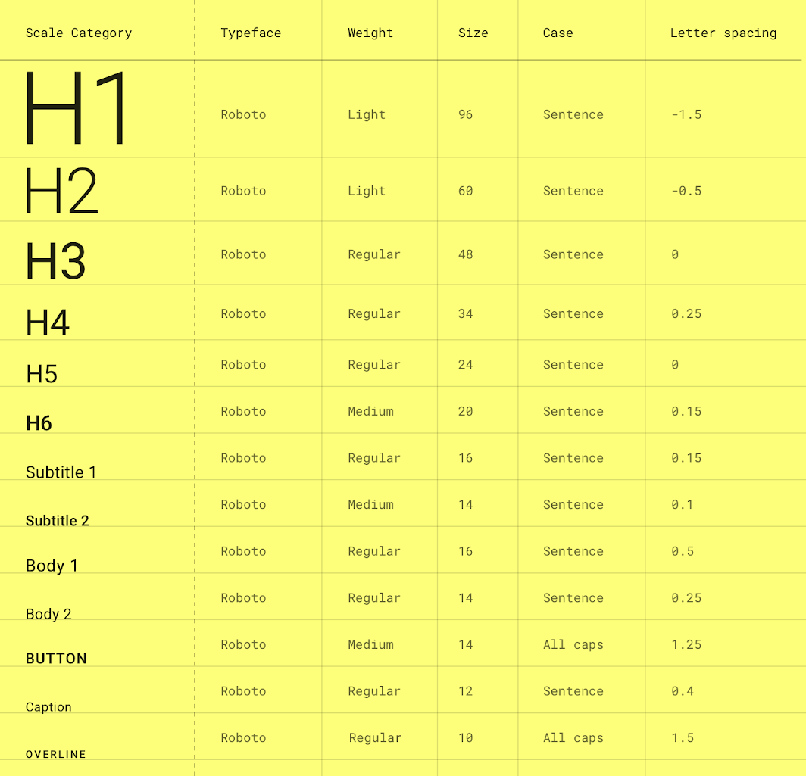

| Data | Versão | Descrição | Participantes|
| -------- | -------- | -------- | --------  |
| 07/09/2020     | 1.0    | Criação do documento    |Wictor Girardi|
| 25/09/2020     | 2.0    | Melhoria do documento   |Lucas Ganda|

# Cuponzim
## Manual Identidade Visual

Sumário:
 - [Logo](#Logo)
 - [Paleta de Cores](#Paleta_de_Cores)
 - [Tipografia](#Tipografia)

## Logo
 

## Paleta de Cores

### Simbologia 
-  A cor escolhida para ser uma das principais da paleta foi um tom derivado do Vermelho que segundo a psicologia das cores está associada ao consumo e desejo, estimulando o ato de comprar
-  A outra cor escolhida para ser uma das principais foi um tom derivado do Amarelo que segundo a psicologia das cores está associada ao estímulo, simpatia e aconchego, sendo usada geralmente para gerar dinamismo e alegria
-  Uma das cores escolhidas para ser secundária foi um tom de Preto que segundo a psicologia das cores expressa poder e sofisticação
-  Outra cor escolhida para ser secundária foi um tom de Azul que segundo a psicologia das cores expressa confiança, profissionalismo e sinceridade
-  Por fim, a última cor escolhida para ser secundária foi um tom de Verde que segundo a psicologia das cores expressa dinamismo e energia

Sendo as 2 cores principais escolhidas por representar aspectos visados pela aplicação com base na psicologia das cores e as 3 secundárias pela representação com base na psicologia das cores e por harmonizarem com as 2 cores principais.

## Tipografia

Para a tipografia do projeto iremos trabalhar utilizando a fonte Roboto, sendo esta a escolhida por ser a fonte padrão do sistema operacional Android.

## Referências

Material Design. 2020. Material Design. [online] Disponível em: <https://material.io/design/typography/the-type-system.html#type-scale> [Acessado 25 Setembro 2020].

Produtora de vídeo | Matilde Filmes. 2020. Psicologia Das Cores: Guia Avançado Para Profissionais. [online] Disponível em: <http://www.matildefilmes.com.br/psicologia-das-cores-guia-avancado-para-profissionais/> [Accessado 25 September 2020].