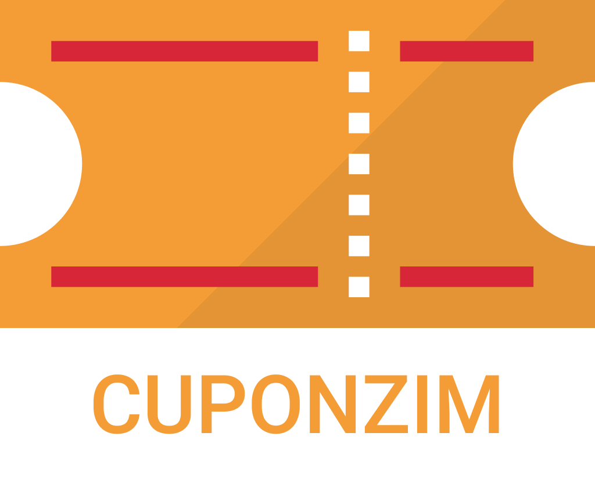

| Data | Versão | Descrição | Participantes|
| -------- | -------- | -------- | --------  |
| 07/09/2020     | 1.0    | Criação do documento    |Wictor Girardi|

# Cuponzim
## Manual Identidade Visual

Sumário:
 - [Logo](#Logo)
 - [Paleta de Cores](#Paleta_de_Cores)
 - [Tipografia](#Tipografia)

## Logo
 

## Paleta de Cores

A cor principal escolhida para a paleta foi um tom derivado do *Vermelho* que segundo a psicologia das cores está associado ao consumo e desejo, estimulando o ato de comprar. Aspectos visados pela aplicação. Os demais tons foram derivados do principal ou que trabalham de acordo com a cor principal.

## Tipografia

Para a tipografia do projeto iremos trabalhar utilizando a fonte Roboto.