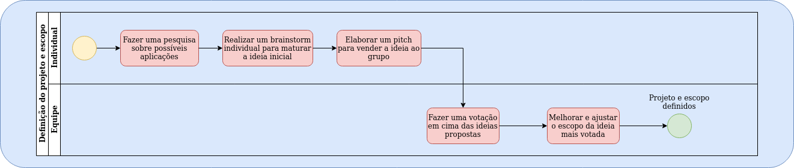

# Histórico de versão

| Data       | Versão | Descrição                                          | Participantes                                                                   |
| ---------- | ------ | -------------------------------------------------- | ------------------------------------------------------------------------------- |
| 26/09/2020 | 1.0    | Criação do documento | Lucas Ganda e João de Assis|
| 26/09/2020 | 1.1    |Processo de escolha de projeto | André Freitas|
| 26/09/2020 | 1.2    |Processo de desenvolvimento | André Freitas|

 

# Modelagem

BPMN (Business Process Model and Notation) é uma notação gráfica de gerenciamento de processos de negócio e tem como objetivo facilitar o entendimento do usuário acerca dos processos.

## Processo Geral 

### Versão 1.0

## Processo de Escolha de Projeto e Escopo 

### Versão 1.0

## Processo de Desenvolvimento de Feature 

### Versão 1.0

## Referências
Business Process Modeling Notation BPMN. [ebook] Business Process Modeling Notation BPMN: Decanato de Planejamento e Orçamento. Disponível em: <http://www.dpo.unb.br/images/phocadownload/dpr/biblioteca/BPMN.pdf> [Accessado 28 September 2020].