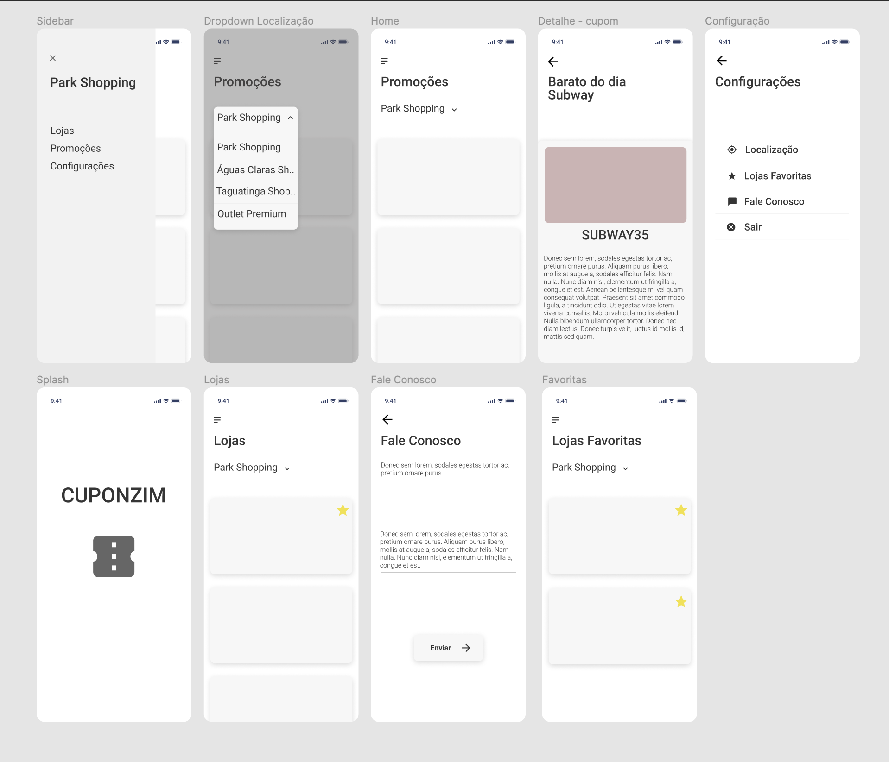

| Data       | Versão | Descrição             | Participantes  |
| ---------- | ------ | --------------------- | -------------- |
| 01/09/2020 | 0.1    | Criação do documento  | Wictor Girardi |
| 07/09/2020 | 0.2    | Melhoria do documento | Wictor Girardi |
| 10/09/2020 | 0.3    | Melhoria do documento | Wictor Girardi |

# Introdução

Protótipo é uma ferramenta usada para se obter respostas iniciais sobre os requisitos através de um modelo funcional do produto esperado, antes de efetivamente construí-lo. Já que um protótipo é tangível, ele permite que as partes interessadas façam experiências com um modelo do seu produto final ao invés de somente discutirem representações abstratas dos seus requisitos.

# Objetivo

O objetivo do protótipo é obter feedbacks do usuário e elicitar requisitos com bases nesses feedbacks.

# Metodologia

O protótipo inicial foi feito na ferramenta figma para o design inicial das telas e fluxo da aplicação.

# Protótipo de Baixa Fidelidade

Esse protótipo de baixa fidelidade foi realizado nos primeiros dias do projeto e visa fazer o levantamento de requisitos para o projeto.

