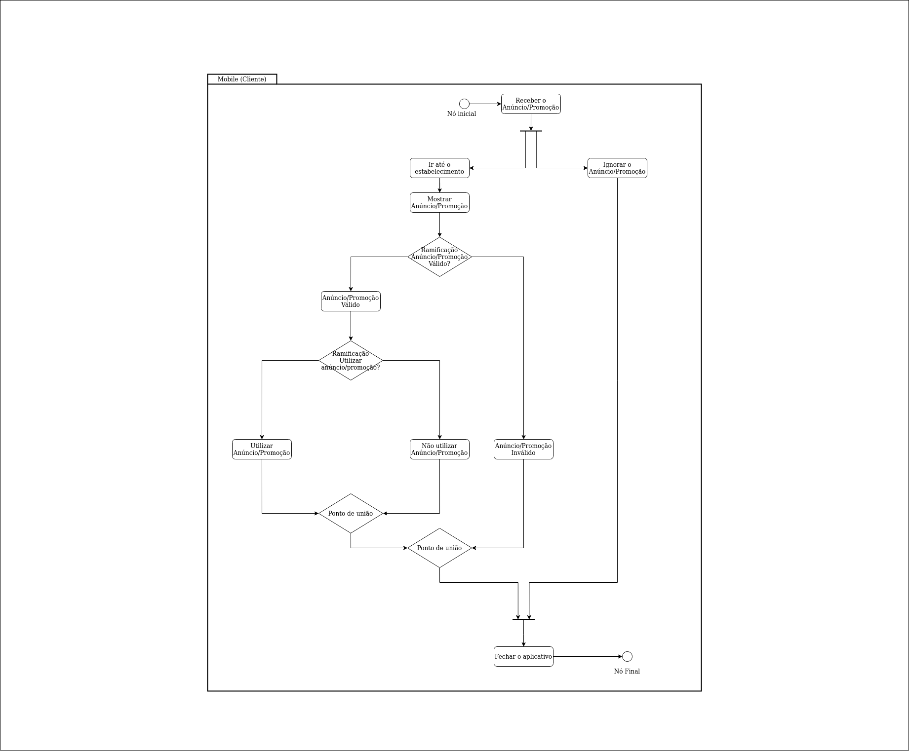

# Histórico de versão

| Data       | Versão | Descrição                                          | Participantes                                                                   |
| ---------- | ------ | -------------------------------------------------- | ------------------------------------------------------------------------------- |
| 25/09/2020 | 1.0    | Criação do documento | André Freitas, João de Assis, Lucas Ganda, João Lucas Zarbiélli, Wictor Girardi |
| 26/09/2020 | 1.0    | Adicionando parte do logista | André Freitas |

 

# Diagrama de Atividades

Um diagrama de atividade é essencialmente um gráfico de fluxo, mostrando o fluxo de controle de uma atividade para outra e serão empregados para fazer a modelagem de aspectos dinâmicos do sistema. Na maior parte, isso envolve a modelagem das etapas sequenciais em um processo computacional.

## v1.0

### Mobile destinado ao Cliente

### Web destinado ao Lojista

## Referências

[Wikipedia](https://pt.wikipedia.org/wiki/Diagrama_de_atividade) **Diagrama de atividade**

