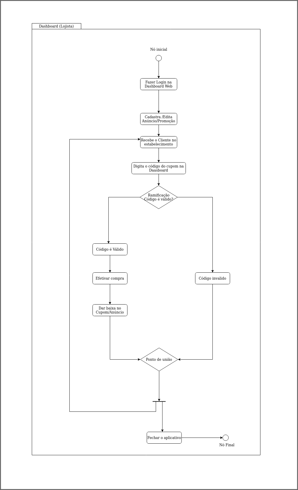

# Histórico de versão

| Data       | Versão | Descrição                                          | Participantes                                                                   |
| ---------- | ------ | -------------------------------------------------- | ------------------------------------------------------------------------------- |
| 25/09/2020 | 1.0    | Criação do documento | André Freitas, João de Assis, Lucas Ganda, João Lucas Zarbiélli, Wictor Girardi |
| 26/09/2020 | 1.1    | Adicionando parte do logista | André Freitas |
| 26/10/2020 | 1.2    | Modificando diagramas e documento com correções pontuais| João de Assis |

 

# Diagrama de Atividades

Um diagrama de atividade é essencialmente um gráfico de fluxo, mostrando o fluxo de controle de uma atividade para outra e serão empregados para fazer a modelagem de aspectos dinâmicos do sistema. Na maior parte, isso envolve a modelagem das etapas sequenciais em um processo computacional.

O diagrama de atividade oferece uma série de benefícios, entre eles:

* Demonstrar a lógica de um algoritmo.

 * Descrever as etapas realizadas em um caso de uso UML.

  *  Ilustrar um processo de negócio ou fluxo de trabalho entre usuários e o sistema.

   * Simplificar e melhorar qualquer processo ao esclarecer casos de uso complicados.

   * Modelar elementos de arquitetura de software, como método, função e operação.

Os diagramas elaborados para esse projeto foram os seguintes:
## v1.2

### Mobile destinado ao Cliente

### Web destinado ao Lojista

## Referências

[Wikipedia](https://pt.wikipedia.org/wiki/Diagrama_de_atividade) **Diagrama de atividade**

[Lucid Chart](https://www.lucidchart.com/pages/pt/o-que-e-diagrama-de-atividades-uml) **Diagrama de Atividade**

