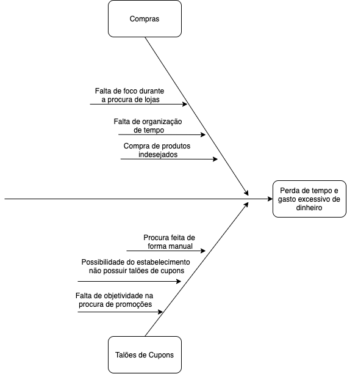
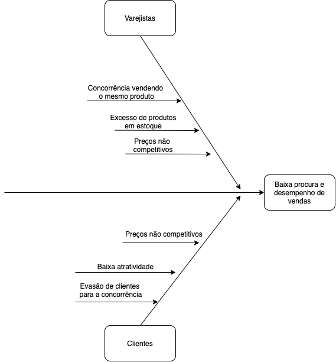

| Data       | Versão | Descrição             | Participantes  |
| ---------- | ------ | --------------------- | -------------- |
| 10/09/2020 | 0.3    | Melhoria do documento | Wictor Girardi |

# Causa e Efeito

# Introdução

O Diagrama de Causa-Efeito, também chamado de “Diagrama de Ishikawa” ou Diagrama de Espinha de Peixe, tem como objetivo identificar as causas de problemas que devem ser resolvidos através de uma representação gráfica.

# Objetivo

Este documento tem como objetivo mostrar alguns dos principais problemas enfrentados durante a ida a shoppings, feiras e outlets para a realização de compras, utilizando o Diagrama de Causa-Efeito.

# Metodologia

Todos os integrantes do grupo ficaram responsáveis pela produção do Diagrama Causa-Efeito, sendo que eles foram produzidos com o auxílio da ferrementa Draw.io.

# Diagramas

Diagrama de causa e efeito representando as possiveis dificuldades encontradas no processo de compra visto pelo usúario.

Diagrama de causa e efeito representando as possiveis dificuldades encontradas no processo de compra visto pelo Varejista.

# Conclusão

O uso do Diagrama de Ishikawa ajuda a manter essas atividades em constante aprimoramento e facilita a solução dos seus problemas elevando o nível de compreensão da equipe sobre o problema a ser resolvido.

# Referências

O QUE É E COMO FAZER UM DIAGRAMA DE ISHIKAWA? Disponível em: https://www.siteware.com.br/metodologias/diagrama-de-ishikawa.
Diagrama de Ishikawa. Disponível em: https://blogdaqualidade.com.br/diagrama-de-ishikawa.