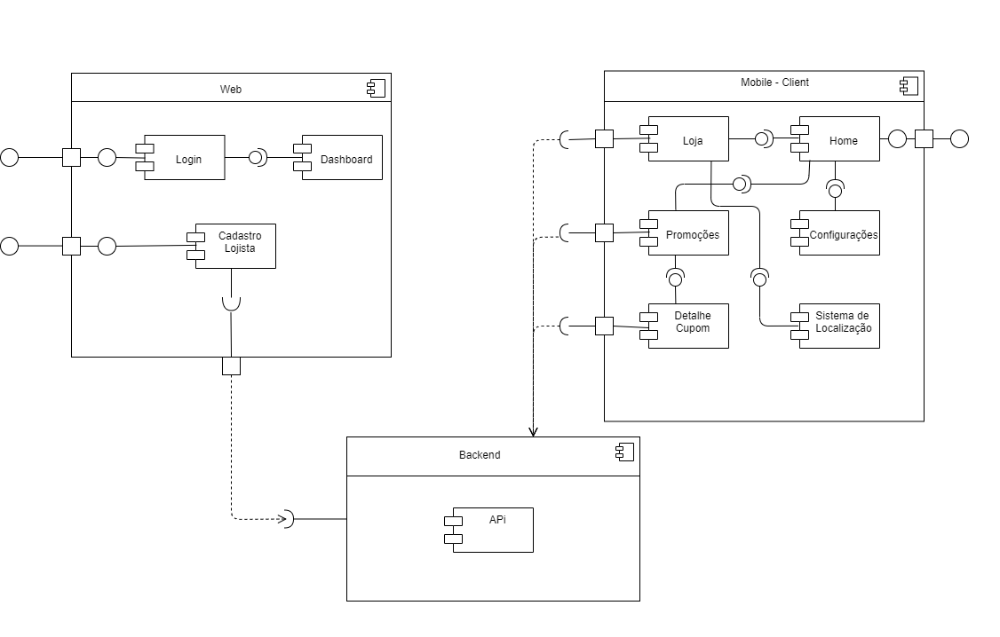

# Histórico de versão

| Data       | Versão | Descrição                                          | Participantes                                                                   |
| ---------- | ------ | -------------------------------------------------- | ------------------------------------------------------------------------------- |
| 25/09/2020 | 1.0    | Criação do documento | André Freitas, João de Assis, Lucas Ganda, João Lucas Zarbiélli, Wictor Girardi |
| 20/11/2020 | 1.1    | Linkando artefato| Lucas Ganda|
 

# Diagrama de Componentes

Um diagrama de componentes permite a verificação de que a funcionalidade necessária de um sistema é aceitável. Esses diagramas também são usados ​​como uma ferramenta de comunicação entre o desenvolvedor e as partes interessadas do sistema. Os programadores e desenvolvedores usam os diagramas para formalizar um roteiro para a implementação, permitindo uma melhor tomada de decisão sobre a atribuição de tarefas ou melhorias de habilidades necessárias. Os administradores de sistema podem usar diagramas de componentes para planejar com antecedência, usando a visão dos componentes lógicos de software e seus relacionamentos no sistema

## v1.0

 Diagrama feito usando como base o documento de : [Rich Picture](rich_picture.md)
 

## Referências

[Wikipedia](https://en.wikipedia.org/wiki/Component_diagram) **Component Diagram**

