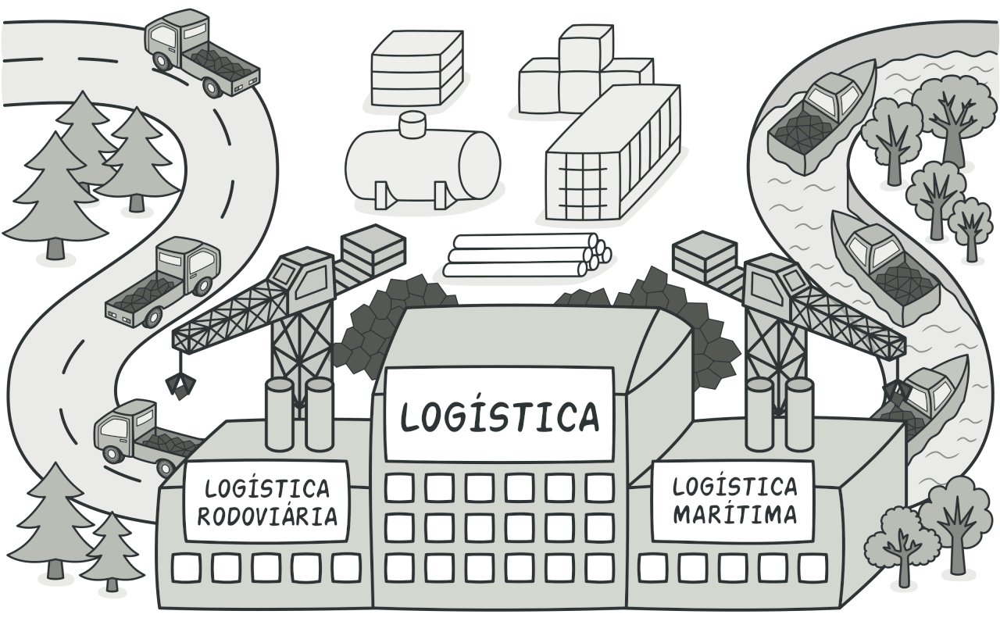

| Data       | Versão | Descrição            | Autor(es)       |
| ---------- | ------ | -------------------- | --------------- |
| 24/10/2020 | 0.1 | Criação de documento com gofs do backend | Lucas Ganda, João Lucas Zarbiélli e João de Assis |
| 25/10/2020 | 0.2| Adição de imagens | Lucas Ganda, João Lucas Zarbiélli e João de Assis |
| 26/10/2020 | 0.3 | Adição de GOFs Front-end | Wictor Girardi |

# GOFS

## 1. Definição
Padrões de projeto são soluções típicas para problemas comuns em projeto de software. Eles são como plantas de obra pré fabricadas que você pode customizar para resolver um problema de projeto recorrente em seu código.

Durante a elaboração do projeto Cuponzim, foram definidos os seguintes GOFS

## 2. Tipos de Gof
Os gofs utilizados para a elaboração deste projeto podem ser separados em 3 tipos: Criacionais e Estruturais.
### 2.1 Gofs Criacionais:
#### 2.1.1 Definição
Os padrões criacionais fornecem vários mecanismos de criação de objetos, que aumentam a flexibilidade e reutilização de código já existente.

#### 2.1.2 GOFS Criacionais: BackEnd
##### 2.1.2.1 Factory Method

O Factory Method é um padrão criacional de projeto que fornece uma interface para criar objetos em uma superclasse, mas permite que as subclasses alterem o tipo de objetos que serão criados.

No backend foi utilizado o factory method durante a definição de entidades no banco de dados.

##### 2.1.2.2 Singleton

O Singleton é um padrão de projeto criacional que permite a você garantir que uma classe tenha apenas uma instância, enquanto provê um ponto de acesso global para essa instância.

Para o projeto utilizamos somente uma instância que realiza a conexão com o banco de dados, para garantir que tenhamos apenas uma conexão com o banco evitando problemas de duplicação de escrita e acesso ao banco.

### 2.2 GOFS Estruturais
#### 2.2.1 Definição
Os padrões estruturais explicam como montar objetos e classes em estruturas maiores mas ainda mantendo essas estruturas flexíveis e eficientes.
#### 2.2.2 GOFS Estruturais: BackEnd
##### 2.2.2.1 Proxy

O Proxy é um padrão de projeto estrutural que permite que você forneça um substituto ou um espaço reservado para outro objeto. Um proxy controla o acesso ao objeto original, permitindo que você faça algo ou antes ou depois do pedido chegar ao objeto original. O proxy pode passar o pedido para o objeto de serviço somente se as credenciais do cliente coincidem com certos critérios (Proxy de Proteção).

No backend foi utilizado a lógica de Proxy para limitar o acesso de algumas rotas estratégicas, onde o proxy verifica o nível de acesso do usuário atraves de JSON Web Token (JWT) e concede ou não o acesso a rota requisitada.

## GOFS FRONT-END

### GOFS
Os GoF's (Gang of Four) são padrões de design que visão prover soluções para problemas comum no desenvolvimento de software. No caso de programação orientada à objetos, os GoF's se propõem a solucionar problemas de interação e geração de objetos, que podem ser aplicados a contexto de problemas reais.São ferramentas poderosas no desenvolvimento de softwares.

Os Padrões de Design Criacionais (Creational Patterns) abstraem a instanciação de objetos. Eles ajudam a criar um sistema independente de como seus objetos são criados, compostos e representados.

## Padrões usados
### Factory Method
O Flutter possui uma arquitetura chamada BLoC (Business Logic Component), a qual tem a função de separar a lógica de negócio da UI através do uso de Streams. Em suma, stream é uma fonte de eventos assíncronos.

Em termos práticos, essa arquitetura BLoC pode ser comparada com o padrão de projeto ‘factory method’.

<code>push()</code>

### Memento
O Flutter usa o padrão memento na pilha de navegação.

### Singleton
No Front-End, usamos a classe Api como um singleton para fazer toda a comunição do front com o gateway, além de utilizar o singleton para lidar com informações de autenticação e utilizar o singleton nativo do flutter.

### Chain of Responsibility

 
A intenção deste padrão é evitar o acoplamento do remetente de uma solicitação ao seu receptor, ao dar a mais de um objeto a oportunidade de tratar essa solicitação. Encadear os objetos receptores, passando a solicitação ao longo da cadeia até que um objeto a trate.

Nesse padrão cada objeto receptor possui uma lógica descrevendo os tipos de solicitação que é capaz de processar e como passar adiante aquelas que requeiram processamento por outros receptores. A delegação das solicitações pode formar uma árvore de recursão, com um mecanismo especial para inserção de novos receptores no final da cadeia existente.

Dessa forma, fornece um acoplamento mais fraco por evitar a associação explícita do remetente de uma solicitação ao seu receptor e dar a mais de um objeto a oportunidade de tratar a solicitação.

Um exemplo da aplicação desse padrão é o mecanismo de herança nas linguagens orientadas a objeto: um método chamado em um objeto é buscado na classe que implementa o objeto e, se não encontrado, na superclasse dessa classe, de maneira recursiva.

### State
O Flutter por default vem com a arqitetura Lifting State Up (Vanilla), o qual é uma derivação do state. Todas as variáveis dentro da classe fazem parte do estado do widget. Nisso, quando alguma delas é alterada no setState(), toda a aplicação é renderizada.

### Strategy

A BaseScreen é o padrão que toda tela deve seguir, ela possui o contexto para o resto da página Widget body, e como toda tela no flutter herda de Widget existe a garantia de que esse contexto sempre existirá.

## 3. Referências 
Refactoring.guru. 2020. O Catálogo Dos Padrões De Projeto. [online] Disponível em : <https://refactoring.guru/pt-br/design-patterns/catalog> [Acessado 25 October 2020].
Padrões de Projetos em Dart<https://medium.com/flutterando/implementando-padr%C3%B5es-de-projetos-em-dart-parte-1-d604f6038460> [Acessado 25 October 2020].
025 – Padrão de Projeto STATE – Design Pattern do FLUTTER<http://davesbalthazar.com.br/025-padrao-de-projeto-state-design-pattern-do-flutter/> [Acessado 25 October 2020].