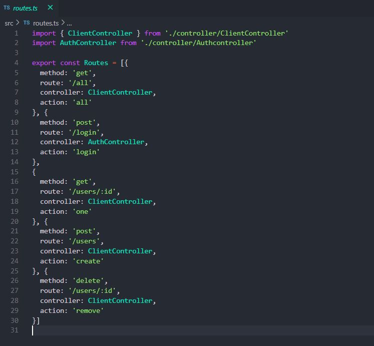
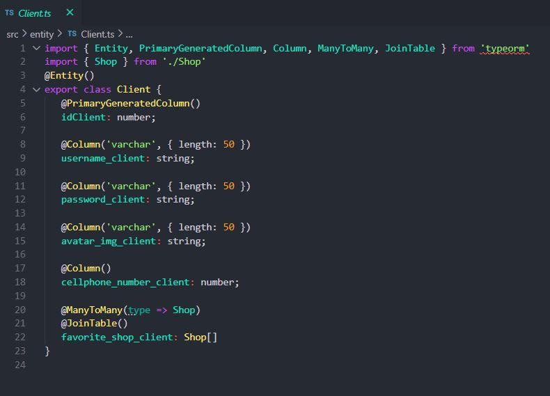
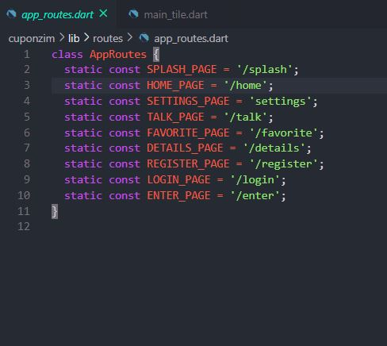
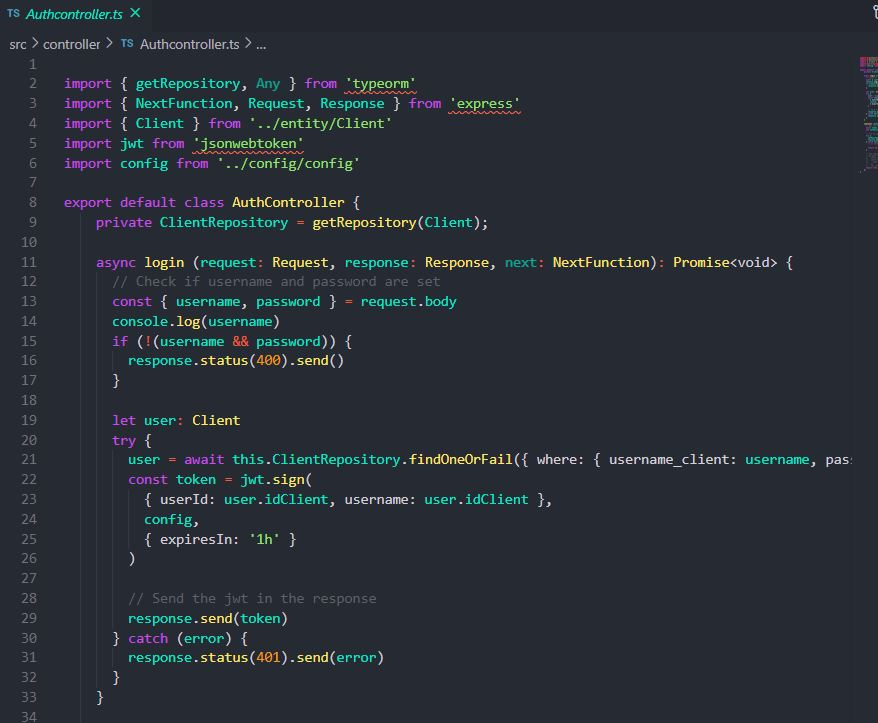
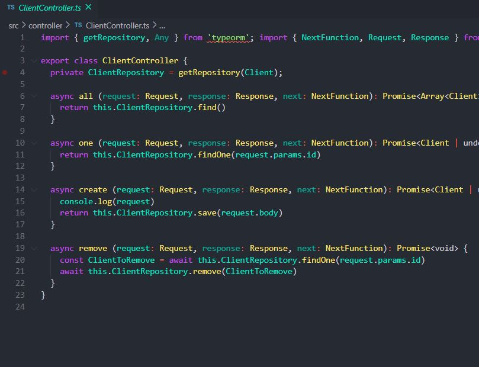
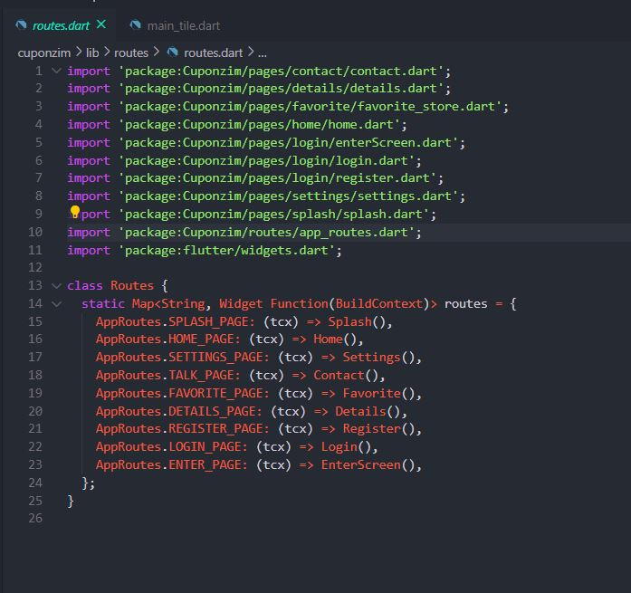
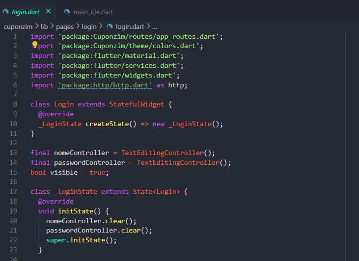

# GRASP

# Histórico de versão

| Data       | Versão | Descrição                                          | Participantes                                                                   |
| ---------- | ------ | -------------------------------------------------- | ------------------------------------------------------------------------------- |
| 17/11/2020 | 0.1    | Criação do documento | Lucas Ganda|
  

# 1. Introdução
GRASP são padrões criados para manter os padrões de qualidade e organização do código de um projeto. Dessa forma é possível analisar quais são as responsibilidades de uma classe, um objeto, um componente, dentre outros, além de idendificar como objetos podem interagir entre si. Sendo estes divididos entre GRASP Criador e GRASP Especialista.

 

# 2. GRASPs
 

# 2.1 Criador
GRASP Criador é o responsável por instanciar e criar objetos através dos relacionamentos entre as classes que serão essenciais para o sistema.

## 2.1.1 Backend
 
 

 

## 2.1.2 Frontend
 

# 2.2 Especialista
GRASP Especialista determina determina quais métodos serão implementados em cada classe, ele é responsável por atribuir responsabilidade de uma determinada operação a uma classe que possui informações necessárias para realizar esta.

## 2.2.1 Backend
 
 

## 2.2.2 Frontend

 
 

# 3. Referências
Translate-me.github.io. 2020. GRASP - Translate.Me. [online] Disponível em: <https://translate-me.github.io/docs/desenho_de_software/padroes/grasp/> [Accesso: 18 November 2020].  
Serrano, M., 2020. Aprender 3: Acesso Ao Site. [online] Aprender3.unb.br. Disponível em: <https://aprender3.unb.br/pluginfile.php/26807/mod_label/intro/Arquitetura%20e%20Desenho%20de%20Software%20-%20Aula%20GRASP%20BASE%20Parte%20I%20-%20Profa.%20Milene.pdf> [Accesso: 18 November 2020].