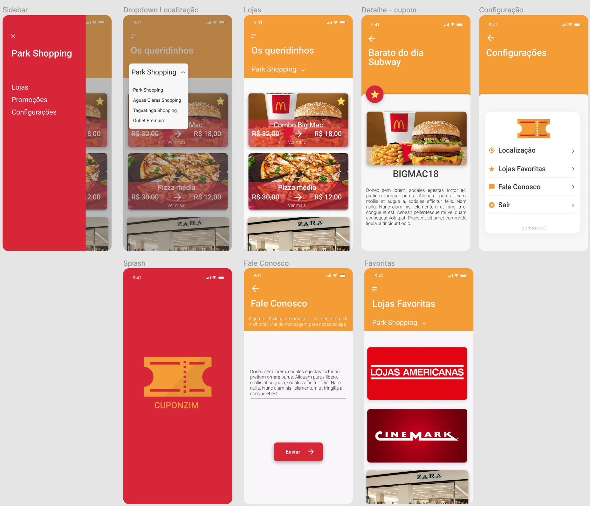

| Data       | Versão | Descrição             | Participantes  |
| ---------- | ------ | --------------------- | -------------- |
| 25/09/2020 | 1.0    | Criação do documento  | Wictor Girardi |

# 1. Introdução

Os protótipos de alta fidelidade abrangem não apenas a interface da pessoa usuária (UI) do produto em termos visuais e estéticos, mas também os aspectos da experiência do(a) usuário(a) (UX) em termos de interações, fluxo e comportamento.

# 2. Metodologia

O protótipo inicial foi feito na ferramenta figma com base no protótipo de baixo nivel das telas e fluxo da aplicação.

# 3. Protótipo de Alta Fidelidade

Esse protótipo de alta fidelidade foi realizado utilizando o manual de identidade visual do projeto e visa apresentar o design e funcionalidade da aplicação.

# 4. Referências

Prototipagem de alta fidelidade: o que é, quando, por que e como usar?
https://medium.com/somos-tera/prototipagem-de-alta-fidelidade-635d745b662b
