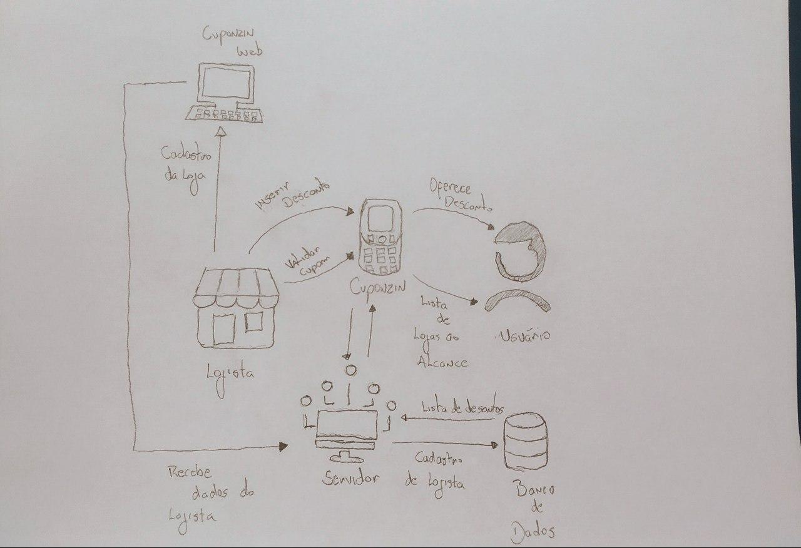
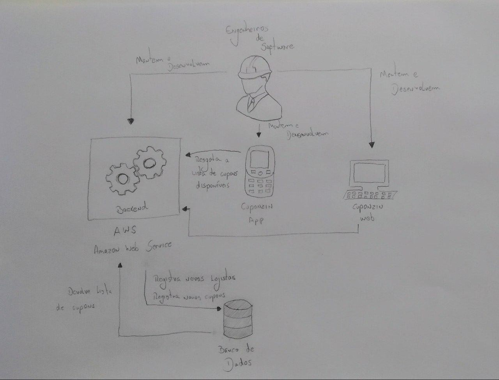
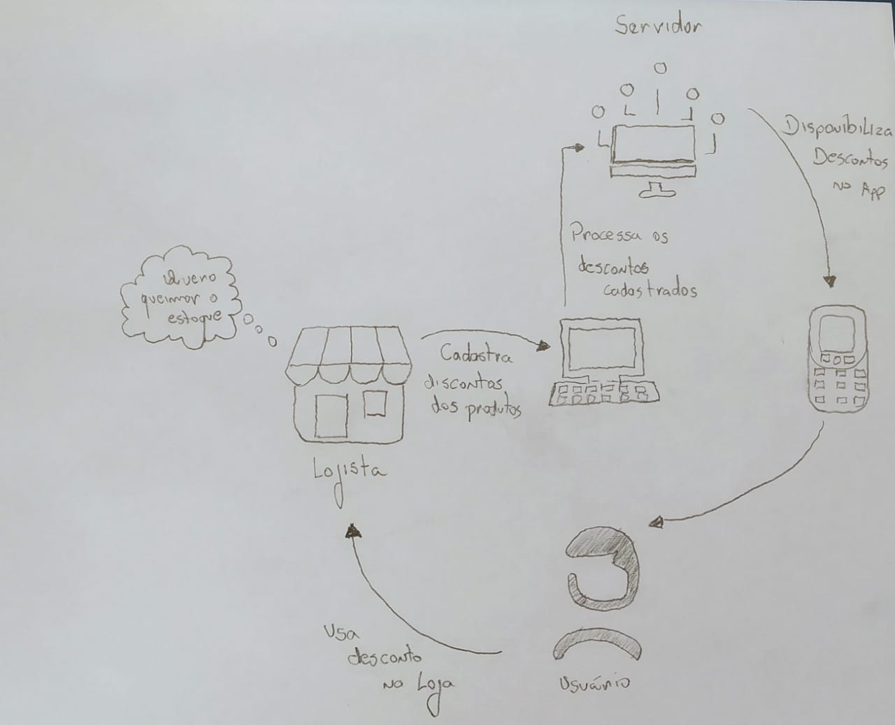
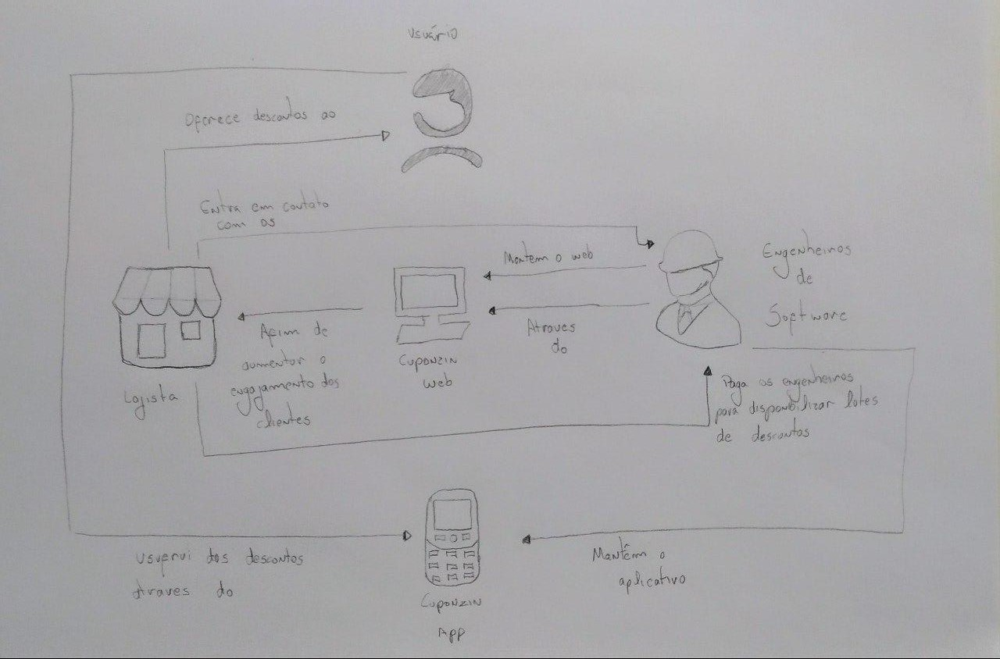

# RichPicture
## Introdução
O Rich Picture é uma técnica que gera um artefato de grau inferior de formalidade, que busca construir pré-rastreabilidade através de desenhos ou diagramas, feitos a mão ou digitalmente, expressando ideias ou funcionalidades e relações entre sistemas e subsistemas. Justamente por ser menos formal, muitas vezes servindo para transparecer a compreensão do problema através da visão dos vários envolvidos, que podem ajudar na criação dos diagramas sem precisar de nenhum conhecimento prévio.

### Operacional v 1.0

### Operacional v 2.0

### Negocio v 1.0

### Negocio v 2.0

| Data       | Versão | Descrição                                          | Participantes                                                                   |
| ---------- | ------ | -------------------------------------------------- | ------------------------------------------------------------------------------- |
| 04/09/2020 | 1.0    | Criação dos RP v 1.0 | João de Assis, Lucas Ganda, João Lucas Zarbiélli, Wictor Girardi |
| 10/09/2020 | 2.0    | Criação dos RP v 2.0 | João de Assis, André Freitas, Lucas Ganda, João Lucas Zarbiélli, Wictor Girardi |
