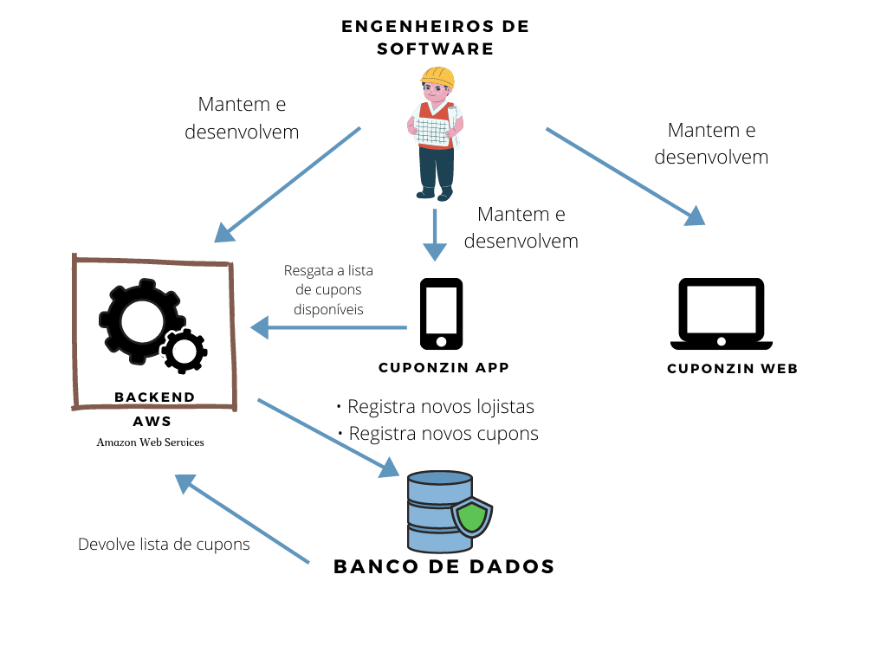
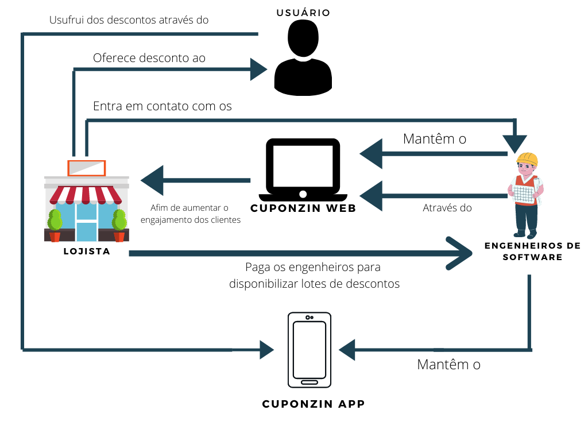

# RichPicture
| Data       | Versão | Descrição                                          | Participantes                                                                   |
| ---------- | ------ | -------------------------------------------------- | ------------------------------------------------------------------------------- |
| 04/09/2020 | 1.0    | Criação dos RP v 1.0 | João de Assis, Lucas Ganda, João Lucas Zarbiélli, Wictor Girardi |
| 10/09/2020 | 2.0    | Criação dos RP v 2.0 | João de Assis, André Freitas, Lucas Ganda, João Lucas Zarbiélli, Wictor Girardi |
| 12/09/2020 | 2.1    | Adicionando tópico 4 | João de Assis |
| 25/09/2020 | 2.2    | Adicionando RP digitais e referências | João Lucas Zarbiélli |

## 1. Introdução
O Rich Picture é uma técnica que gera um artefato de grau inferior de formalidade, que busca construir pré-rastreabilidade através de desenhos ou diagramas, feitos a mão ou digitalmente, expressando ideias ou funcionalidades e relações entre sistemas e subsistemas. Justamente por ser menos formal, muitas vezes servindo para transparecer a compreensão do problema através da visão dos vários envolvidos, que podem ajudar na criação dos diagramas sem precisar de nenhum conhecimento prévio.

Os rich pictures foram feitos após um brainstorm feito com todo o grupo atrvés do Hangouts. Não foi feita a gravação desse brainstorm e portanto não foi possível linka-lo nesse documento. Após o brainstorm e com o auxílio dos fluxos evidenciados pelas rich pictures foi feito o levantamento de alguns requisitos os quais passaram pela técnica de priorização MoSCow e estão disponíveis no tópico 4

## 2. Operacional
### 2.1 Operacional v 1.0

### 2.2 Operacional v 2.0

### 2.3 Operacional v 2.1

### 
## 3. Negocio
### 3.1 Negocio v 1.0

### 3.2 Negocio v 2.0

### 3.3 Negocio v 2.1

## 4. Requisitos levantados

Os requisitos levantados por este documento estão dispostos abaixo, por meio da técnica de priorização [MoSCoW](MoSCoW.md)

| Nome do requisito | Prioridade    | Descricao    |
|----| ----- |----- |
| ReqCli04          |  Must   | O aplicativo deve possibilitar ao usuário ser capaz de visualizar uma lista de estabelecimentos                |
| ReqCli09          |   Must  | O aplicativo deve possibilitar ao usuário escolher um cupom e mostrar suas informações                         |
| ReqLoj01          | Must    | O lojista deve ser capaz de cadastrar seu estabelecimento      |
| ReqLoj02          | Must    | O lojista deve ser capaz de realizar login em sua conta        |
| ReqLoj03          | Must    | O lojista deve ser capaz de fazer logoff de sua conta          |
| ReqLoj04          | Must    | O lojista deve ser capaz de visualizar seus cupons cadastrados |
| ReqLoj05          | Must    | O lojsta deve ser capaz de validar um cupom                    |
| ReqLoj06          | Must    | O lojsta deve ser capaz de cadastrar cupons                    |
| ReqLoj07          | Must    | O lojsta deve ser capaz de excluir cupons                      |
| ReqLoj08          | Must    | O lojsta deve ser capaz de cadastrar cupons                    |

## Referências

[Grupo RocketChat - Requisitos](https://marcosnbj.github.io/2019.1-RocketChat/Pr%C3%A9-Rastreabilidade/RichPicture/) **Rich Pictures**
