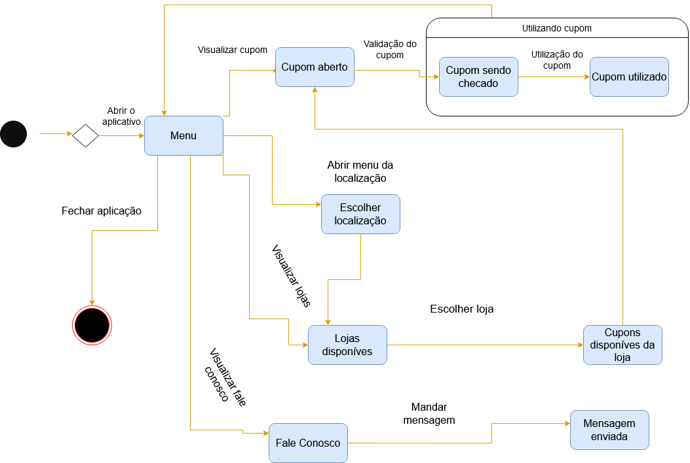
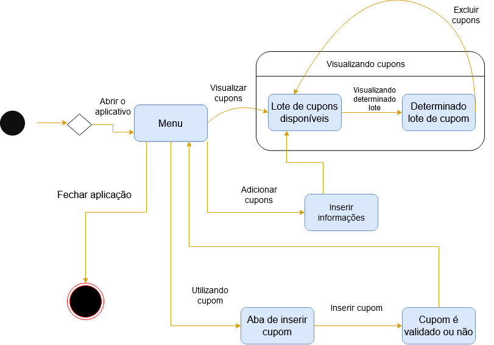

# Histórico de versão

| Data       | Versão | Descrição                                          | Participantes                                                                   |
| ---------- | ------ | -------------------------------------------------- | ------------------------------------------------------------------------------- |
| 25/09/2020 | 1.0    | Criação do documento | André Freitas, João de Assis, Lucas Ganda, João Lucas Zarbiélli, Wictor Girardi |

 

# Diagrama de Estados 

Um diagrama de estados é uma representação gráfica de modelagem de UML dinâmica que representa os estados e as mudanças dos mesmos, dessa forma um objeto passa de um estado inicial até um estado final atráves de uma transição.

## Usuário

## Lojista

